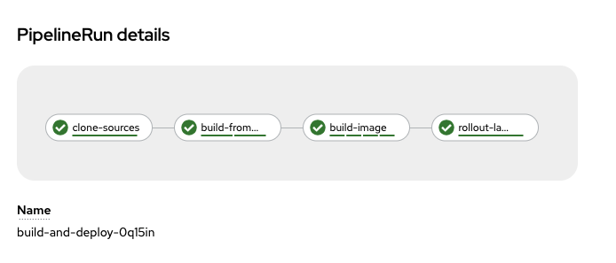

## chat-client pipeline(s)

- utilizing the `pipeline` service account
- created secret to quay `oc create secret docker-registry <name> --from-file=.dockerconfigjson=/Users/jrickard/.docker/config.json`
- linked secret to the pipeline sa `oc secret link pipeline <secret-name> --for=mount,pull`

For the pipeline and tasks to execute, I had to remove the securityContexts attempting to run as `0`

To utilize the clusterTask `openshift-client` I had to remove ARGS and do:

```yaml

- name: step name
  params:
    - name: SCRIPT
      value: oc import-image $(params.is-name):latest --confirm

```

I changed the pvc size from 2Gib to 5Gib

### Using the images:

`quay.io/smileyfritz/chat-client:latest`

1. pulled the image
2. tagged the image
3. pushed the image
4. made repo in quay public
5. gave robot account access to push/pull to repo

I had to change the filesystem in buildah-vols.yaml from `overlay` to `vfs`

Added rolebinding.yaml


### build-and-deploy pipeline



## build-deploy-scan
i made the following changes to pipeline-with-acs-scan.yaml
- added namespace: devsecops
- updated image name to use my repository in quay
- added `--confirm` to the end of image-import

i made the following changes in pipeline-run-with-scan
- updated images repositories
- using service account pipeline
- updated acs-scan-api to my acs instance

i made the following changes in image-scan.yaml
- updated image repositories
- pulled, tagged, pushed roxctl image to quay
- created a secret for acstoken

`oc create secret generic acstoken --from-literal=token=<pasted_token>`

The pipeline fails with at the scan stage because:

 Image quay.io/jrickard0/chat-client:latest failed policy 'Fixable Severity at least Important' (policy enforcement caused failure)
- Description:
    ↳ Alert on deployments with fixable vulnerabilities with a Severity Rating at
      least Important


Changed the install-without-buildah.yaml task file to change the 
image name to my repo

Modified the cosign-pipeline with image from my repo.

cosign-pipelinerun:
- removed the following block from pipelinerun
```yaml
      securityContext:
        runAsUser: 0
        fsGroup: 0

```

